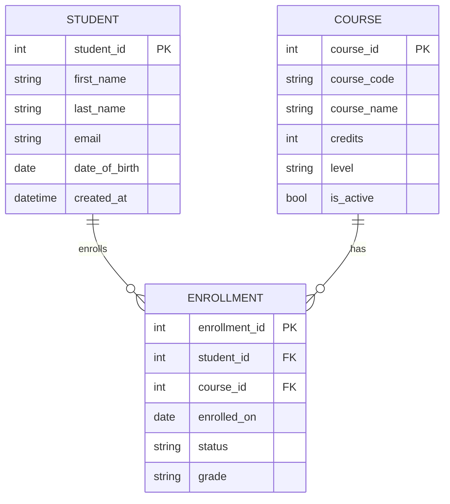

# Week 3 - Activity 1.1

## 任务目标 (中文说明)

为"学生与课程"设计一个数据库 ER 图 (Entity Relationship Diagram)。

- 一个学生可以选修多门课程
- 一门课程也可以被多个学生选修

因此学生与课程之间是典型的 **M:N** 关系，需要通过一个中间表 (bridge table) 来实现。

> 提交要求：请在 GitHub 上传 ER 图截图 + 简短说明。

## ER Diagram (Mermaid)

将下面内容复制到 VS Code 的 Markdown Preview 中即可看到图形。你可以对预览窗口截图，并命名为：`er_w3_a1_1.png` 放在本目录。



## 交付物（已生成）

- `.drawio` 图表文件（可用 draw.io 打开并导出/截图）：
    - `diagrams/er_w3_a1_1.drawio`
- SQL（建表/初始化/查询示例）：
    - `sql/schema.sql`
    - `sql/seed.sql`
    - `sql/queries.sql`
- 源代码（SQLite 最小可运行示例）：
    - `src/db.py`
    - `src/main.py`

## 运行方式（可选）

在仓库根目录执行：

```powershell
cd d:\workshop\MSE800-PSD\week3\activity1_1\src
python main.py
```

## 简短说明

- `STUDENT` 存学生基本信息。
- `COURSE` 存课程信息。
- `ENROLLMENT` 作为中间表，将 M:N 拆成两个 1:N：
  - `STUDENT (1) -> (N) ENROLLMENT`
  - `COURSE (1) -> (N) ENROLLMENT`
- `ENROLLMENT.student_id` 外键指向 `STUDENT.student_id`。
- `ENROLLMENT.course_id` 外键指向 `COURSE.course_id`。
