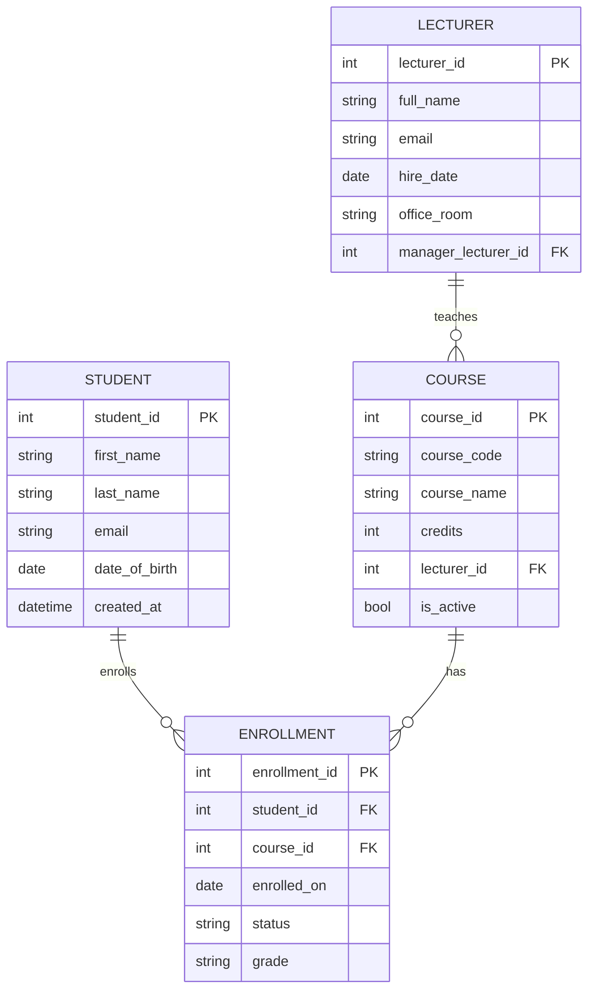

# Week 3 - Activity 1.2

## 任务目标 (中文说明)

在 W3-A1.1 的"学生与课程"ER 设计上，新增一个实体 (例如 Lecturer)，并为该新实体设计 **至少 5 个属性**，其中必须包含：

- Primary Key (PK)
- Foreign Key (FK)

这里我新增实体 `LECTURER`，并在 `LECTURER` 内部加入一个 **自关联外键** `manager_lecturer_id` (FK -> LECTURER.lecturer_id)，表示讲师的主管/导师，从而满足"新实体包含 FK"的要求，同时不需要额外再增加其它实体。

> 提交要求：请上传更新后的 ER 图截图 + 简短说明，并附上 GitHub 链接。

## ER Diagram (Mermaid)

你可以对 Markdown 预览截图，并命名为：`er_w3_a1_2.png` 放在本目录。



## 交付物（已生成）

- `.drawio` 图表文件（可用 draw.io 打开并导出/截图）：
    - `diagrams/er_w3_a1_2.drawio`
- SQL（建表/初始化）：
    - `sql/schema.sql`
    - `sql/seed.sql`
- 源代码（SQLite 最小可运行示例）：
    - `src/db.py`
    - `src/main.py`

## 运行方式（可选）

```powershell
cd d:\workshop\MSE800-PSD\week3\activity1_2\src
python main.py
```

## 简短说明

- 新增 `LECTURER` 表：
  - `lecturer_id` 是 PK
  - `manager_lecturer_id` 是 FK，指向同表 `LECTURER.lecturer_id` (自关联)
- `COURSE.lecturer_id` 是 FK，表示一门课程由某个讲师负责（关系为 Lecturer 1 -> N Course）。
- `STUDENT` 与 `COURSE` 的 M:N 关系仍通过 `ENROLLMENT` 实现。
