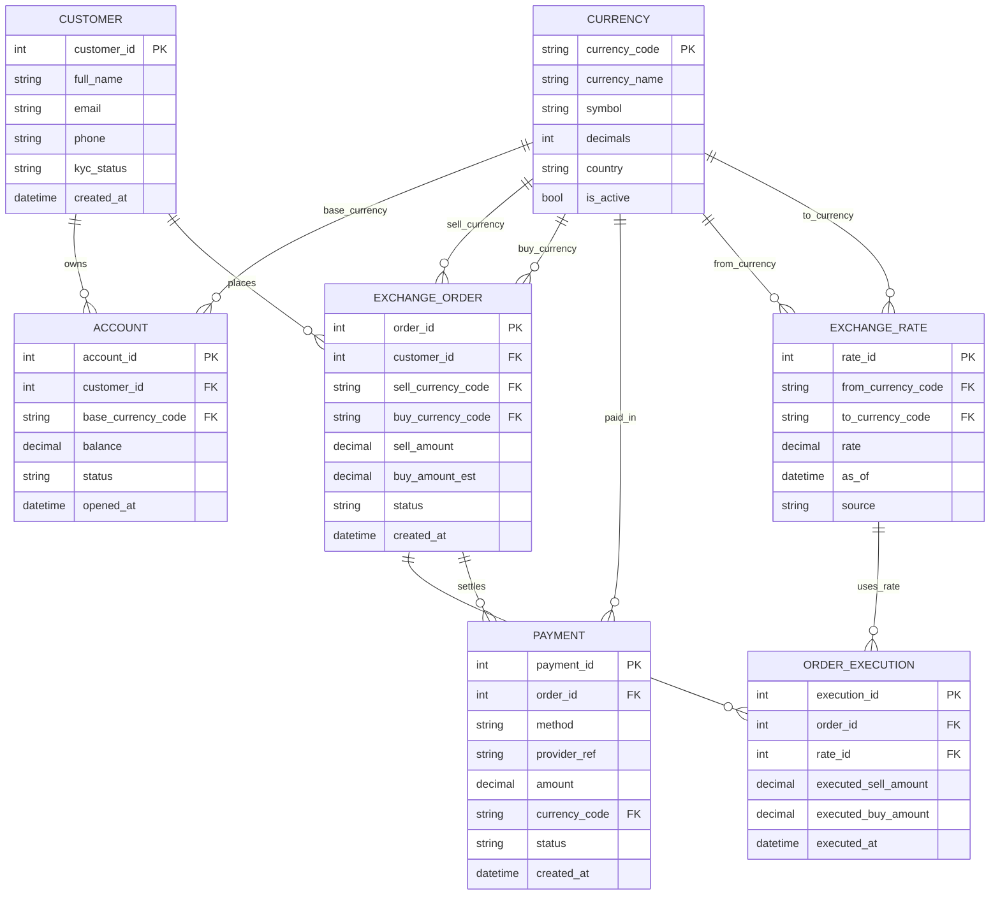

# Week 3 - Activity 2 (Due: Midnight, 1 May 2026)

## 任务目标 (中文说明)

为"finance money exchange software application"设计一个 ER Diagram。

要求：

- 至少 **5 个实体 (entities)**
- 每个实体至少 **5 个属性 (attributes)**
- 属性中要清晰包含 **PK** 与 **FK**
- 清晰标注实体之间的关系类型：`1:1`, `1:N`, `M:N`

下方给出一个可落地的设计：以"客户下单换汇"为核心，覆盖账户、币种、汇率、订单、执行与支付。

> 提交建议：对 Markdown 预览截图，并命名为 `er_w3_activity2.png` 放在本目录。

## ER Diagram (Mermaid)



## 交付物（已生成）

- `.drawio` 图表文件（可用 draw.io 打开并导出/截图）：
    - `diagrams/er_w3_activity2.drawio`
- SQL（建表/初始化）：
    - `sql/schema.sql`
    - `sql/seed.sql`
- 源代码（SQLite 最小可运行示例）：
    - `src/db.py`
    - `src/main.py`

## 运行方式（可选）

```powershell
cd d:\workshop\MSE800-PSD\week3\activity2\src
python main.py
```

## 关系说明 (1:1 / 1:N / M:N)

- `CUSTOMER (1) -> (N) ACCOUNT`：一个客户可以有多个账户（例如不同基础币种账户）。
- `CUSTOMER (1) -> (N) EXCHANGE_ORDER`：一个客户可以下多笔换汇订单。
- `CURRENCY (1) -> (N) EXCHANGE_RATE`：每个币种可以参与多条汇率记录（from/to 两条关系分别表示）。
- `EXCHANGE_ORDER (1) -> (N) ORDER_EXECUTION`：一笔订单可被拆分为多次执行（部分成交）。
- `EXCHANGE_ORDER (1) -> (N) PAYMENT`：一笔订单可能对应多次支付/退款/补款等（简化模型）。

## 设计说明 (为什么这样设计)

- 用 `CURRENCY` 做统一的币种字典表，避免在各处硬编码字符串。
- 用 `EXCHANGE_RATE` 存汇率快照 (as_of + source)，保证订单执行时可追溯。
- 用 `ORDER_EXECUTION` 表达"一笔订单多次成交"的现实情况。
- `PAYMENT` 与订单分离，方便扩展支付渠道与对账。

## 可选扩展 (如果你想加分)

- 增加 `COMPLIANCE_CHECK` (反洗钱/风控) 实体，并把 `check_status` 与 `reviewed_by` 关联到订单。
- 增加 `LECTURER`/`STAFF`/`USER` 作为后台操作员实体（用于审计与权限）。
- 增加 `TRANSACTION_LEDGER` 做会计分录，保证资金流闭环。
