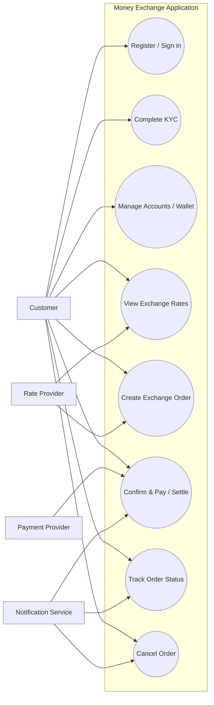
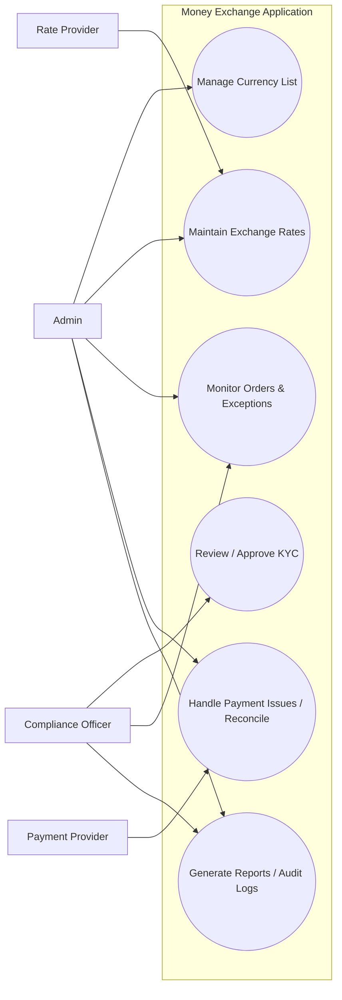

# Week 4 - Activity 3: Use Case Diagrams (Money Exchange)

## Task

Develop **use case diagrams** for a finance money exchange software application (based on **W3-A2**).

Requirements satisfied:

- At least **two** use case diagrams
- A short description for each diagram (purpose + key actors)

What to submit:

- The diagram sources are included in `diagrams/` as Mermaid files:
  - `diagrams/use_case_1_customer_flow.mmd`
  - `diagrams/use_case_2_back_office.mmd`

There is **no Python source code requirement** for Activity 3 (this activity is diagram + explanation only).

> Note: Mermaid does not have a dedicated `usecaseDiagram` syntax, so the diagrams below use `flowchart` with a **system boundary** and “oval-style” use case nodes.

---

## Diagram 1: Customer Exchange Flow

### Purpose

Show the main customer-facing interactions: onboarding, viewing rates, placing exchange orders, payment/settlement, and tracking order status.

### Key actors

- **Customer**: registers, places orders, pays, tracks progress.
- **Payment Provider**: processes card/bank payments.
- **Rate Provider**: supplies FX rates (or snapshots).
- **Notification Service**: sends confirmations and status updates.

Mermaid source file: `diagrams/use_case_1_customer_flow.mmd`

---

## Diagram 2: Back-Office / Administration

### Purpose

Show the administrative and operational functions required to keep the platform running: currency setup, rate management, KYC review, payment issue handling, and reporting/audit.

### Key actors

- **Admin**: manages configuration (currencies, users, basic operations).
- **Compliance Officer**: reviews KYC and suspicious activities.
- **Rate Provider**: supplies live/snapshot rates.
- **Payment Provider**: payment status callbacks and reconciliation.

Mermaid source file: `diagrams/use_case_2_back_office.mmd`

## GitHub Submission

Push this folder to your GitHub repository, then share the repository link.
